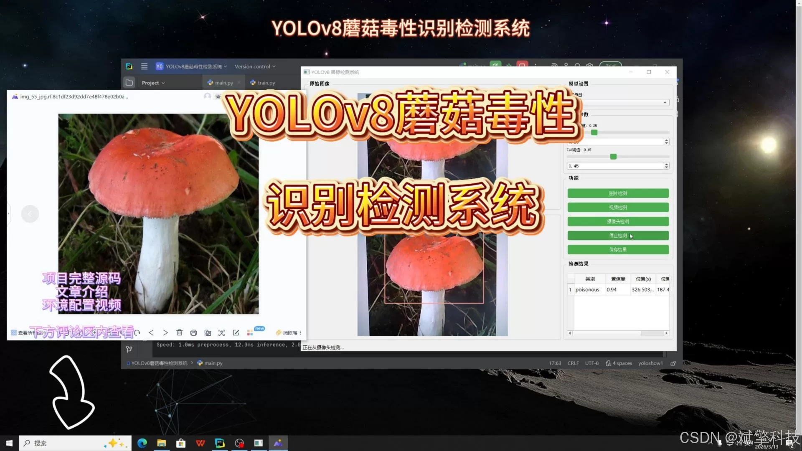
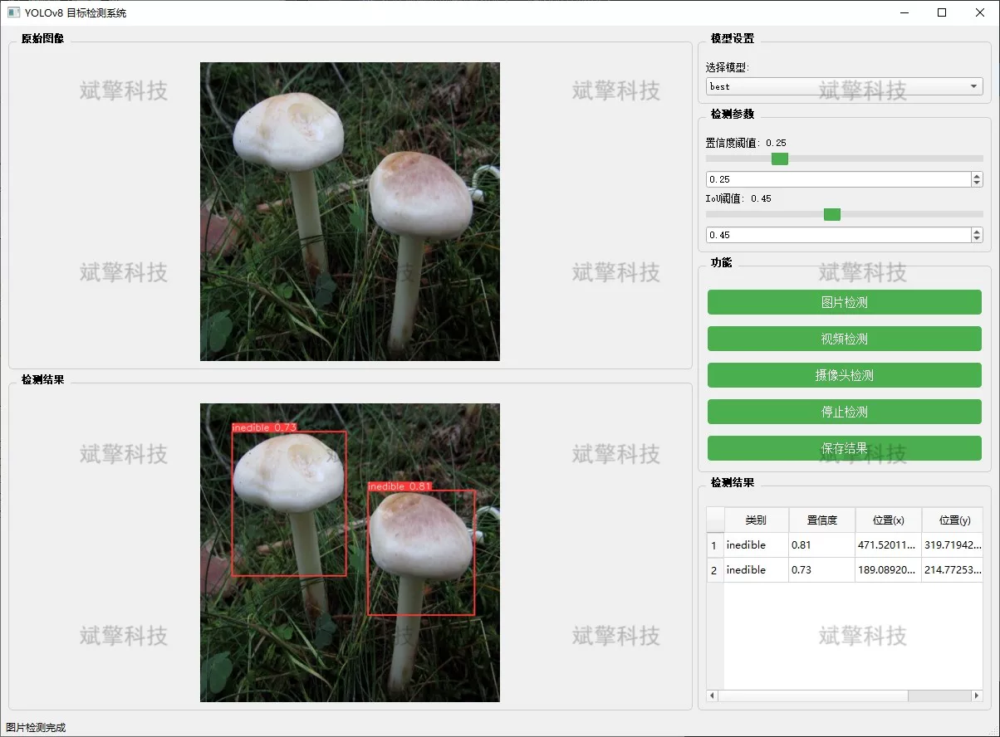
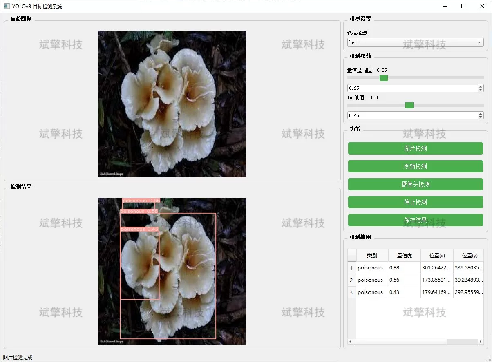
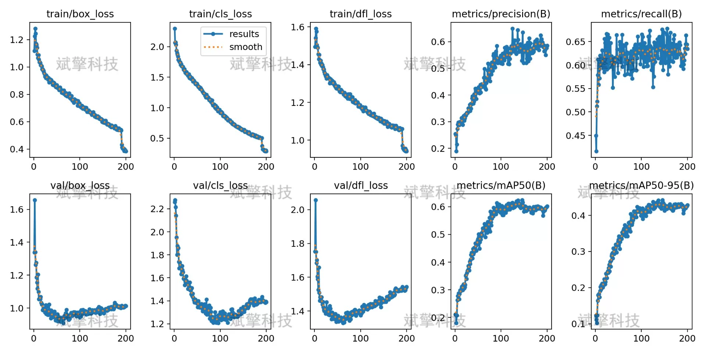

# Based on YOLOv8 deep learning for mushroom toxicity detection system (YOLOv8+Y)

## Body

Based on the YOLOv8 deep learning algorithm, this project proposes and implements a mushroom toxicity detection system.

The system aims to achieve real-time and accurate classification of mushroom images through computer vision technology, providing toxic warnings for mushrooms. The main functions of the system include image detection, video file detection, and real-time camera detection, which can classify mushrooms into three categories: edible, poisonous, and inedible. Experimental results show that the model has good recognition accuracy and robustness on the test set, providing users with convenient field assistance for identification, and has certain social application value and popular science significance.

System Features
✅ Image Detection: Can detect images and return detection boxes and category information.
✅ Video Detection: Supports input of video files, detecting the situation in each frame of the video.
✅ Real-Time Camera Detection: Connects USB cameras to achieve real-time monitoring.
✅ Parameter Real-Time Adjustment (Confidence and IoU Threshold)
Dataset Overview
Training Set: 2019 images
Validation Set: 576 images
Test Set: 288 images

## Images

## Payment

Here is a pay link on Stripe ( https://buy.stripe.com/3cs8yP7sY87d0vu9AB ). Please contact me lonlonago@foxmail.com after funding $89, and I will send you a complete data files , thank you!

